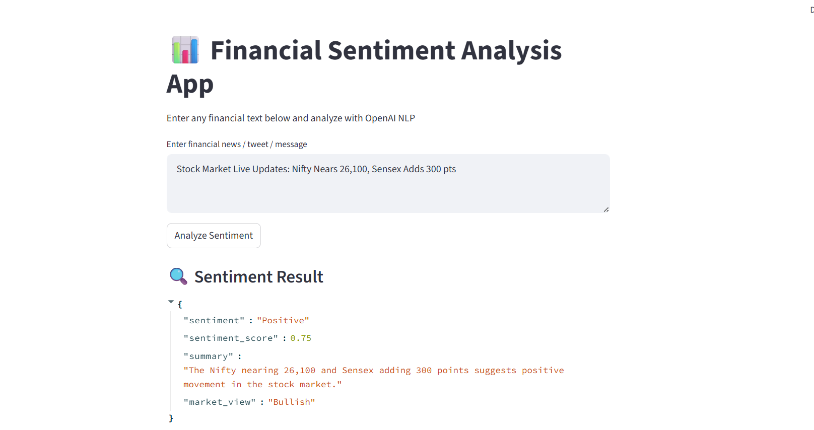

 📊 Financial Sentiment Analysis App




Analyze stock market news, tweets, and financial statements using OpenAI-powered NLP.
This app identifies sentiment, generates a summary, and classifies the market view as Bullish, Bearish, or Neutral.

🚀 Features

✔ Predict sentiment → Positive, Negative, Neutral
✔ Generate summary of the statement
✔ Provide sentiment score (0.0 to 1.0)
✔ Determine market view → Bullish / Bearish / Neutral
✔ Clean UI built with Streamlit
✔ JSON auto-repairing (no parsing errors!)
✔ Uses latest OpenAI 1.0 API
✔ Works on Windows/Mac/Linux

🧠 Technologies Used

Python 3

OpenAI GPT (gpt-4o-mini model)

Streamlit

Regex for JSON Repair

JSON module

📂 Project Structure
finance_openai/
│── app.py
│── sentiment.py
│── requirements.txt
│── README.md

🛠 Installation & Setup
1️⃣ Clone or download the project
git clone https://github.com/yourusername/finance_openai.git
cd finance_openai

2️⃣ Install required dependencies

Create a virtual env (optional but recommended):

python -m venv venv
venv\Scripts\activate   # Windows
source venv/bin/activate  # Mac/Linux


Install packages:

pip install -r requirements.txt

3️⃣ Add your OpenAI API key

Open sentiment.py and replace:

client = OpenAI(api_key="YOUR_API_KEY_HERE")


with your actual API key.

▶ Run the Application

Start Streamlit:

streamlit run app.py


App opens in browser automatically at:

http://localhost:8501

🧪 Example Input
Nifty rose by 2% today due to strong buying interest in banking stocks.

📤 Example Output
{
    "sentiment": "Positive",
    "sentiment_score": 0.82,
    "summary": "The statement indicates upward momentum driven by strong buying.",
    "market_view": "Bullish"
}

🧩 How It Works

User submits text

OpenAI GPT analyzes financial language

The model returns structured JSON

JSON is auto-repaired (no ```json errors!)

UI displays:

Sentiment

Market View

Score

Summary
